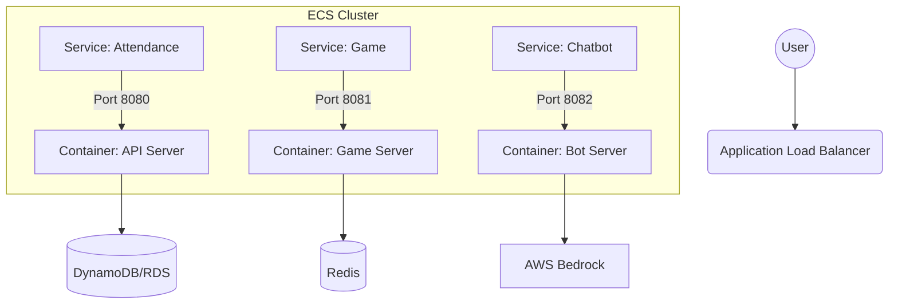

# ECS 서비스 구현 로드맵

ECS를 통해 **출석체크**, **게임**, **챗봇**을 구성하는 것은 훌륭한 확장 계획입니다.
각 서비스의 복잡도와 인프라 의존성을 고려할 때, 다음 순서로 진행하는 것을 **강력히 추천**합니다.

## 🏁 추천 개발 순서

### 1단계: 출석체크 (Attendance Check) - "Hello World"
**가장 먼저 해야 합니다.** 로직이 가장 단순(CRUD)하기 때문에, **ECS 인프라가 제대로 잡혔는지 검증**하기에 최적입니다.
- **목표**: ECS 클러스터 생성, 로드밸런서(ALB) 연결, 도커 이미지 배포, DB(RDS/DynamoDB) 연결 확인.
- **기술적 포인트**:
    - Python (Flask/FastAPI) 또는 Node.js로 간단한 API 서버 구축.
    - `/attendance/check`, `/attendance/status` API 구현.
    - **성공 기준**: 웹 포털에서 API를 호출했을 때 ECS 서버가 응답을 주면 성공.

### 2단계: 이벤트 게임 (Event Game) - "Stateful & Performance"
**그 다음입니다.** 출석체크로 기본이 잡히면, 좀 더 동적인 기능을 붙여봅니다.
- **목표**: 사용자 인터랙션 처리, 실시간성 테스트.
- **기술적 포인트**:
    - 간단한 미니게임 (예: 클릭 게임, 주사위 등).
    - Redis를 활용한 단기 데이터 저장 (게임 세션).
    - 트래픽이 몰릴 때 ECS 오토스케일링(Auto Scaling)이 잘 동작하는지 테스트해볼 수 있음.

### 3단계: AI 챗봇 (Chatbot) - "Integration"
**마지막입니다.** 외부 서비스(Bedrock)와의 연동이 필요하고, 스트리밍(SSE/WebSocket) 등 복잡한 프로토콜이 들어갈 수 있습니다.
- **목표**: AWS Bedrock 연동, 긴 응답 시간 처리.
- **기술적 포인트**:
    - `boto3`를 이용한 Bedrock API 호출.
    - 챗봇 응답 스트리밍 구현 (사용자 경험 중요).
    - IAM Role 설정이 중요 (ECS Task Role에 Bedrock 접근 권한 필요).

---

## 🏗️ ECS 아키텍처 (제안)

## 🚀 당장 시작해야 할 것 (1단계)

1.  **ECS 클러스터 생성**: 콘솔에서 빈 클러스터를 만드세요 (Fargate 권장).
2.  **도커 파일(Dockerfile) 작성**: "출석체크"용 간단한 Python/Node 서버 코드를 짜고 Dockerfile을 만드세요.
3.  **ECR 레포지토리 생성**: 도커 이미지를 올릴 저장소를 만드세요.
4.  **배포**: ECS Task Definition을 만들고 Service를 실행해 보세요.
