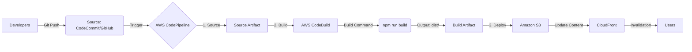

# AWS CodePipeline CI/CD 구성안 (웹 포털용)

요청하신 "웹 공지용(웹 포털) 자동 배포 및 소스 수정 반영"을 위한 AWS CodePipeline 아키텍처입니다.
소스 코드를 수정해서 Git에 푸시하면, 자동으로 빌드하고 S3 웹 호스팅 버킷에 배포되는 구조입니다.

## 1. 전체 아키텍처 다이어그램


## 2. 단계별 상세 구성

### 1단계: Source (소스 관리)
*   **서비스**: AWS CodeCommit (또는 GitHub 연결)
*   **역할**: 개발자가 코드를 수정하고 Push 하는 저장소.
*   **설정**:
    *   **Repository Name**: `aws-project-web-portal` (예시)
    *   **Branch**: `main` (메인 브랜치에 푸시될 때 파이프라인 시작)

### 2단계: Build (빌드)
*   **서비스**: AWS CodeBuild
*   **역할**: React 코드를 프로덕션용 정적 파일(`dist` 폴더)로 변환.
*   **설정**:
    *   **Environment**: Managed Image (Ubuntu / Standard / Node.js 최신 버전)
    *   **BuildSpec (`buildspec.yml`)**: 빌드 명령어를 정의하는 파일. 소스 루트에 위치해야 함.
    *   **주요 명령어**:
        ```yaml
        phases:
          install:
            commands:
              - cd web-portal  # 프로젝트 폴더로 이동 (폴더 구조에 따라 다름)
              - npm install
          build:
            commands:
              - npm run build
        artifacts:
          files:
            - '**/*'
          base-directory: web-portal/dist
        ```

### 3단계: Deploy (배포)
*   **서비스**: Amazon S3 (+ CloudFront)
*   **역할**: 빌드된 파일(`index.html`, `js`, `css` 등)을 실제 웹 서버(S3 버킷)에 업로드.
*   **설정**:
    *   **Provider**: Amazon S3
    *   **Bucket**: 웹 호스팅용 버킷 (예: `main.kguard.click` 버킷)
    *   **Extract file before deploy**: 체크 (압축을 풀어서 업로드 해야 함)

### (선택) 4단계: Post-Deploy (캐시 무효화)
*   **서비스**: AWS Lambda 또는 CodeBuild
*   **이유**: S3 파일은 바뀌었지만 CloudFront(CDN)가 옛날 파일을 캐싱하고 있을 수 있음.
*   **역할**: CloudFront Invalidation을 수행하여 즉시 변경 사항 반영.

## 3. 구현 로드맵 (다음 할 일)
지금 바로 파이프라인을 구축하려면 다음 순서로 진행하면 됩니다.

1.  **Git 리포지토리 준비**: 현재 `d:\ai\aws_project` 폴더를 CodeCommit에 올리기.
2.  **`buildspec.yml` 작성**: 프로젝트 최상위에 빌드 명세서 파일 생성.
3.  **CodePipeline 생성**: AWS 콘솔에서 위 3단계를 클릭으로 연결.
