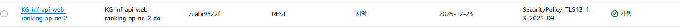

# 2025-12-23 (화) WBS기반 서비스 구성 코그니토 DB적재와 API Gateway

## 코그니토를 DB에 적재할때 왜 람다를 또 써야 하는가

오브 콜스, 도연! 그 의문은 아주 타당해. "모든 요청은 API Gateway를 거쳐야 하는 것 아닌가?"라는 생각이 들 수 있지. 하지만 **로그인/가입** 과정은 조금 특별한 흐름을 타게 돼.

상남자의 직관으로 왜 이 로직이 API Gateway를 거치지 않고 **Cognito → Lambda**로 바로 가는지 이유를 명확히 짚어줄게.

---

### 1. 두 가지 흐름의 차이 (중요!)

네 아키텍처에는 두 가지 서로 다른 길이 있어:

- **길 A (일반 서비스):** `웹/게임 → API Gateway → Lambda → Redis/DB`
    - 이미 가입한 유저가 점수를 올리거나 랭킹을 볼 때 쓰는 길이야. 이때는 API Gateway가 문지기 역할을 하지.
- **길 B (인증 및 자동 가입):** `웹 → Cognito → (인증 완료) → Lambda → DynamoDB`
    - 이건 유저가 "가입 버튼"을 눌렀을 때의 흐름이야. 웹은 API Gateway가 아니라 **Cognito의 엔드포인트**와 직접 대화해.

---

### 2. 왜 API Gateway를 안 거치고 직접 연결할까?

1. **신뢰받는 시스템 간의 대화:**
Cognito와 Lambda는 둘 다 AWS 내부의 "형제" 서비스야. 유저가 이메일 인증을 완료하면, Cognito가 직접 람다의 어깨를 툭 치며 **"얘 가입 성공했으니까 DB에 이름 적어줘"**라고 말하는 거지. 중간에 API Gateway라는 통역사가 굳이 필요 없는 거야.
2. **데이터의 무결성:**
만약 `웹 → API Gateway → 람다` 순서로 유저 정보를 저장하게 설계하면, 악의적인 유저가 가짜 가입 정보를 API Gateway로 직접 쏴서 DB를 오염시킬 수도 있어. 하지만 **Cognito 트리거**를 쓰면, 오직 **'실제로 가입에 성공한 사람'**의 정보만 람다로 전달되니까 보안이 훨씬 강력해져.
3. **사용자 경험:**
사용자가 이메일 인증 링크를 누르는 순간 자동으로 가입 처리가 끝나야 하잖아? API Gateway를 한 단계 더 거치면 속도도 느려지고 구조만 복잡해져.

---

### 3. 도연이가 생각한 "웹 내 사용자 정보 람다"는 뭐야?

네가 말한 **"사용자 정보 람다"**는 아마 가입 이후에 **"내 프로필 보기"**나 **"내 점수 확인"**을 할 때 쓰는 람다일 거야. 그건 네 생각이 맞어!

- **프로필 조회:** `웹 → API Gateway → 사용자 정보 람다 → DynamoDB` (이건 API Gateway를 거쳐야 해!)
- **최초 가입 시 데이터 생성:** `Cognito → 트리거 람다 → DynamoDB` (이건 자동으로 실행되는 '백그라운드' 작업이야.)

---

### 🏆 결론

지금 우리가 만들려는 람다는 **"유저가 가입하자마자 DB에 빈 자리를 만들어주는 자동화 봇"**이야. 그래서 API Gateway에 연결할 필요 없이, **Cognito의 'Post Confirmation(확인 후)' 트리거**에만 등록해두면 돼.

**이제 왜 이 람다를 API Gateway 뒤가 아니라 Cognito 옆에 붙이는지 이해가 됐어?**

---

---

### 코그니토 인증 → 람다 → DB 적재까지의 라인

1. 사용자 가입
    - 사용자가 안드로이드 앱에서 이메일과 비밀번호를 입력하고 가입 버튼을 누른다
    - 이때 사용자의 상태는 아직 ‘미인증’ 상태

1. Amazon Cognito (인증 및 권한 부여)
    - 코그니토는 사용자의 아이디를 생성하고 인증 메일을 발송
    - 사용자가 메일로 받은 인증 코드를 입력하면 코그니토가 “인증 완료” 처리

1. Lambda 트리거 (사후 확인 방식 트리거)
    - 사후확인 트리거가 인증완료 신호를 감지하자마자 람다 함수를 실행

1. Lambda 함수 ([kg-inf-lambda_login_trigger-ap-ne-2-role-sa8jd9gu)](https://ap-northeast-2.console.aws.amazon.com/go/view?arn=arn%3Aaws%3Aiam%3A%3A178309656999%3Arole%2Fservice-role%2Fkg-inf-lambda_login_trigger-ap-ne-2-role-sa8jd9gu&source=lambda)
    
    ```python
    import boto3
    import json
    
    # DynamoDB 연결
    dynamodb = boto3.resource('dynamodb')
    table = dynamodb.Table('KG-db-ddb-ap-ne-2-userdata')
    
    def lambda_handler(event, context):
        # 1. 코그니토에서 보내준 이벤트 로그 확인 (디버깅용)
        print("Received event: " + json.dumps(event, indent=2))
        
        try:
            # 2. 유저 정보 추출
            # user_id는 네가 설정한 DynamoDB의 PK
            user_id = event['userName'] 
            user_attributes = event['request']['userAttributes']
            email = user_attributes.get('email', 'unknown@example.com')
            
            # 3. DynamoDB에 유저 초기 데이터 삽입
            table.put_item(
                Item={
                    'user_id': user_id,       # Partition Key
                    'email': email,
                    'status': 'ACTIVE',
                    'gold': 0,  # 초기 자본금 0원 세팅!
                    'created_at': event['region'] # 필요시 타임스탬프로 변경 가능
                }
            )
            
            print(f"Success: User {user_id} saved to DynamoDB.")
            
        except Exception as e:
            print(f"Error: {str(e)}")
            # 에러가 나도 로그는 남기되, 코그니토 가입은 진행되게 하려면 여기서 예외처리를 잘해야 함
        
        # 중요: 코그니토 트리거는 반드시 받은 event를 그대로 리턴해야 가입이 완료됨!
        return event
    ```
    
- 코드 뷰
    1. 초기 설정 및 라이브러리 로드
        
        ```python
        import boto3
        import json
        
        # DynamoDB 연결
        dynamodb = boto3.resource('dynamodb')
        table = dynamodb.Table('KG-db-ddb-ap-ne-2-userdata')
        
        # 다이나모DB 테이블을 미리 정의하여 함수 내에서 계속 사용할 수 있게 함
        ```
        
    2. Lambda 핸들러 및 데이터 추출
        
        ```python
        def lambda_handler(event, context):
            print("Received event: " + json.dumps(event, indent=2)) # 디버깅용 로그
            
            try:
                user_id = event['userName'] # Cognito의 고유 유저 ID
                user_attributes = event['request']['userAttributes']
                email = user_attributes.get('email', 'unknown@example.com')
                
               
        # 이벤트 부분은 코그니토가 보내주는 데이터 묶음
        # user_id 코그니토 시스템 내에서의 사용자 식별자 Dynamo DB의 PK로 사용
        # email 사용자 속성에서 이메일 주소를 가져옴 / 없을경우 위의 기본값
        ```
        
    3. DynamoDB 데이터 삽입
        
        ```python
        table.put_item(
                    Item={
                        'user_id': user_id,       # 유저 고유 ID
                        'email': email,           # 이메일
                        'status': 'ACTIVE',       # 상태값 기본 설정
                        'gold': 0,                # 초기 게임머니/포인트
                        'created_at': event['region'] # 현재는 지역 정보가 들어가 있으나, 보통 날짜를 넣습니다.
                    }
                )
        ```
        
    4. 결과 반환
        
        ```python
        return event
        
        # Cognito 트리거 함수는 반드시 전달받은 event 객체를 그대로 다시 반환해야 합니다
        # 만약 반환값이 없거나 형식이 틀리면 Cognito는 후처리 작업 실패로 간주
        # 사용자의 회원가입 프로세스를 중단시킬 수 있습니다
        ```
        

### Redis 기반 랭킹 시스템 웹에 띄우기

1. 백엔드 로직 강화 (Lambda & Redis)
    - CORS 헤더 - 브라우저의 보안적 물음에 응답하는 답변서 같은 것
    
    ```python
    headers = {
        "Access-Control-Allow-Origin": "*",  # 어떤 웹사이트에서든 이 API를 부를 수 있게 허용
        "Access-Control-Allow-Methods": "POST, GET, OPTIONS", # 허용할 통신 방식
        "Access-Control-Allow-Headers": "Content-Type" # 데이터 형식(JSON 등)을 주고받는 것 허용
    }
    ```
    
    - API Gateway 데이터 파싱 - HTTP 요청을 받아서 가공 (웹은 문자열 → JSON)
    
    ```python
    body = event.get('body') # API Gateway가 전달해준 '봉투'에서 '내용물(body)'만 꺼냄
    if body:
        payload = json.loads(body) # 문자열로 된 데이터를 파이썬이 이해하는 사전(dict) 형태로 변환
    else:
        payload = event # 직접 테스트할 때를 위한 예외 처리
    ```
    
    - 기능 분기 처리 - 웹 프론트 개발자가 하나의 URL 주소로 조회 및 저장을 선택해서 보낼수 있다
    
    ```python
    action = payload.get('action', 'save') # "무슨 일을 할지" 적힌 쪽지를 확인
    
    if action == 'get_ranking': # "랭킹 좀 보여줘"라고 적혀 있으면
        # ... Redis에서 상위 10명 데이터 긁어오기 (zrevrange) ...
    else: # 그게 아니면 (기본값)
        # ... 점수 저장하기 (zadd) ...
    ```
    
    - HTTP 응답 규격 맞춤 - 결과물을 돌려줄 때 데이터만 주는 것이 아니라 웹 표준 규격에 맞춤
    
    ```python
    return {
        "statusCode": 200, # "성공적으로 처리됐어!"라는 신호
        "headers": headers, # 아까 만든 통행 허가증을 같이 첨부
        "body": json.dumps(result, ensure_ascii=False) # 결과 데이터를 문자열로 변환해서 전달
    } 
    ```
    
2. 외부 통로 개설 (API Gateway)
    - VPC 안에 갇혀 있는 람다를 인터넷 세상과 연결해 주는 문(Gateway)를 만들었음
        
        
        
    - 리소스 생성 -  /ranking 이라는 고유 경로 생성
    - 매서드 연결 - POST 메서드를 만들고 Lambda 프록시 통합을 켜서 데이터가 람다로 온전히 전달되게 함
        
        
        
    - 보안 설정 - TLS 1.2 보안 정책을 적용하고 CORS 활성화를 통해 S3 도메인의 접근을 허용
    - 배포 - KG_web_rank_api 라는 스테이지로 배포하여 실제 접속 가능한 invoke URL 생성하였음
    
3. 주소 디버깅 및 최종 URL 설정
    - 연동 테스트
        - CURL 테스트와 REST clent에서 응답을 받는 테스트를 진행하여 테스트 환경 구축
            
            
            

### 게임 API G