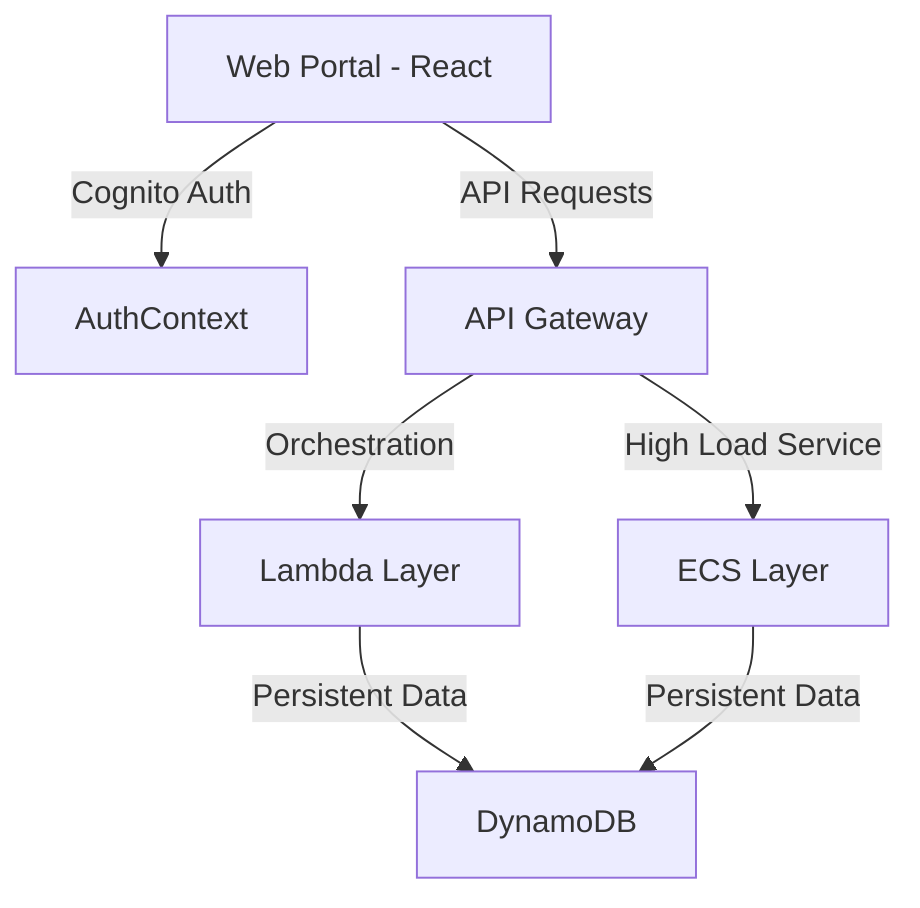

# 웹-백엔드 연동 아키텍처 보고서

본 보고서는 K-Guard 시스템의 프론트엔드와 백엔드 간 통합 연동 로직의 핵심 역할과 설계 의도를 요약합니다.

---

## 🏗️ 시스템 레이어 개요

---

## 1. 인증 레이어 (Cognito & AuthContext)

*   **책임 (Responsibility)**: 사용자 신원 확증의 **단일 진실 공급원(Single Source of Truth)**.
*   **프론트 호출 트리거**: 웹 앱 구동 시 세션 확인(Mount) 및 로그인 시도.
*   **구조적 이유 (Security)**:
    *   **보안**: 백엔드 코드에 사용자 비밀번호를 직접 저장하지 않음으로써 데이터 유출 리스크를 원천 차단합니다.
    *   **확장성**: 사용자 세션 관리를 AWS가 대행하므로 수만 명의 동시 접속자가 몰려도 백엔드 서버 부하가 전혀 발생하지 않습니다.

## 2. API Gateway (시스템의 가드)

*   **책임 (Responsibility)**: 모든 프론트엔드 요청의 **중앙 집중식 엔트리 포인트**.
*   **프론트 호출 트리거**: 모든 API 통신 (`api.js` 내부 함수 호출).
*   **구조적 이유 (Scalability)**:
    *   **단일 추상화**: 프론트엔드는 하나의 URL만 알면 되며, 실제 로직이 Lambda인지 ECS인지 알 필요가 없어 운영 유연성이 높습니다.
    *   **CORS 및 속도 제한**: 무분별한 외부 호출을 차단하고 트래픽 폭주 시 서비스 안정성을 보호하는 방패 역할을 합니다.

## 3. Lambda Layer (이벤트 기반 연산)

| 컴포넌트 | 책임 (Responsibility) | 실질적 역할 |
| :--- | :--- | :--- |
| **`web_mypage.py`** | 유저 메타데이터 집계 | 마이페이지 접속 시 보유 캐릭터, 출석 현황 등 산재된 정보를 통합 제공. |
| **`high_score_lambda.py`** | 랭킹 처리 오케스트레이션 | 게임 종료 시 점수를 검증하고 랭킹 시스템에 전달. |

*   **구조적 이유 (Cost-Efficiency)**: 요청이 있을 때만 자원을 소모하므로 상시 가동 비용을 절감하며, 간헐적인 트래픽 폭증에도 즉각적으로 대응할 수 있습니다.

## 4. ECS Layer (고성능 비즈니스 로직)

| 컴포넌트 | 책임 (Responsibility) | 실질적 역할 |
| :--- | :--- | :--- |
| **Attendance Service** | 출석체크 핵심 비즈니스 로직 | 매일 1회 출석 여부 판단, 보상(Cash) 지급 및 DB 갱신 처리. |
| **Ranking Service** | 대규모 랭킹 조회 및 집계 | 전역 랭킹 및 실시간 순위 변동성 대응. |

*   **구조적 이유 (Performance)**: 
    *   **지속적 성능**: 랭킹 조회나 출석체크처럼 요청 빈도가 높고 DB 쓰기가 빈번한 작업에 대해 컨테이너 환경에서 안정적인 응답 속도를 보장합니다.
    *   **Auto-scaling**: 부하 발생 시 태스크(Task) 수가 유동적으로 조절되어 시스템 중단을 방지합니다.

## 5. DynamoDB (글로벌 영속 레이어)

*   **책임 (Responsibility)**: 시스템 전체의 **실시간 데이터 저장소**.
*   **구조적 이유 (Availability)**: 
    *   **저지연(Low Latency)**: 수천만 건의 데이터가 쌓여 있어도 밀리초(ms) 단위의 일관된 응답을 제공합니다.
    *   **서버리스 확장**: 별도의 DB 튜닝 없이도 트래픽에 따라 자동으로 성능이 확장되어 운영 부담이 최소화됩니다.

---
**[보고서 요약]** 
본 구조는 **'인증과 단순 관리는 서버리스(Cognito, Lambda)'**로 비용과 보안을 챙기고, **'데이터 처리가 집중되는 핵심 기능은 컨테이너(ECS)'**로 성능을 확보한 **하이브리드 아키텍처**입니다.
